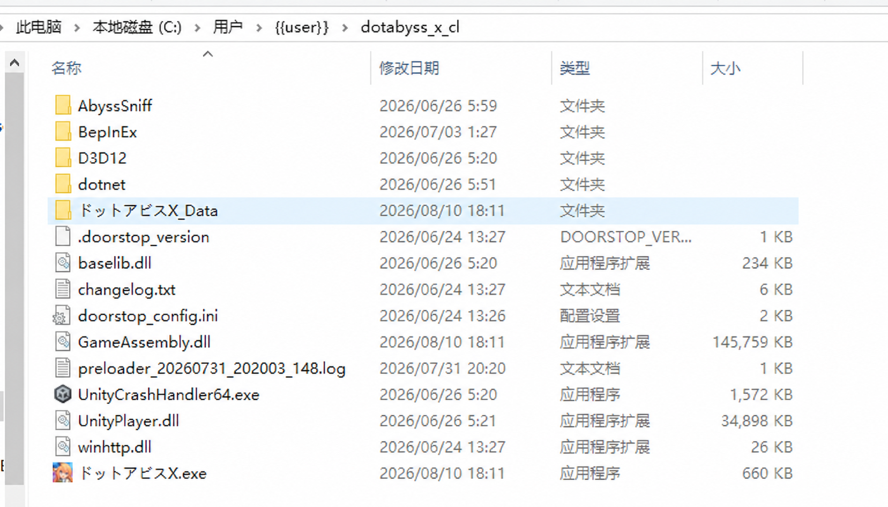
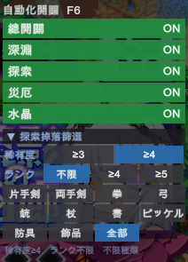
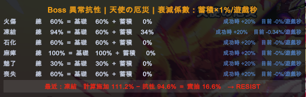
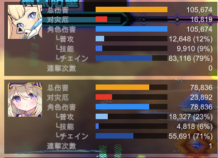

# Dot Abyss Remaster

完全免費發布，禁止商用
反饋及 Bug 提交請至
QQ: 1057775708

## 安裝

1. 關閉遊戲與 DMM GAME PLAYER。
2. 到 [Releases](../../releases) 下載最新版的 `Source code (zip)`。
3. 解壓縮後，開啟最外層的版本資料夾。
4. 將資料夾內的所有檔案複製到遊戲目錄：

   ```text
   C:\Users\{{user}}\dotabyss_x_cl
   ```

   `{{user}}` 是目前登入 Windows 的使用者名稱。系統詢問是否合併資料夾或覆蓋檔案時，選擇允許。

5. 覆蓋完成後，確認以下檔案位於對應位置：

   ```text
   C:\Users\{{user}}\dotabyss_x_cl\ドットアビスX.exe
   C:\Users\{{user}}\dotabyss_x_cl\winhttp.dll
   C:\Users\{{user}}\dotabyss_x_cl\BepInEx\plugins\AbyssSniff\AbyssSniff.dll
   C:\Users\{{user}}\dotabyss_x_cl\BepInEx\plugins\AbyssSniff\reroll_config.json
   ```

6. 啟動遊戲。第一次啟動可能需要幾分鐘；成功載入後，右上角會出現插件面板。

### 覆蓋完成示意

`BepInEx`、`dotnet`、`winhttp.dll` 與 `ドットアビスX.exe` 應位於下圖所示的同一個遊戲根目錄：



## Bug 修正

1. 負面狀態施加失敗時，不再清除已成功施加的負面狀態。
2. 修正戰鬥中連擊率提升 Buff 實質不生效。
3. 修正「漆黑之杖」的負面狀態提升 Buff 效果與說明不同，現在可以正常疊加。

## 角色修正

1. ラヴェリア：情熱紋章改為敵人被擊倒時賦予，不限定由自身擊倒。
2. クリスティ：ステラレコード 重複賦予時，持續時間改為疊加而不是覆蓋。
3. フィルム：ノワール憑依重複賦予時，持續時間改為疊加而不是覆蓋。

## 功能

1. **自動探索裝備 Reroll**
   依稀有度、出現 Rank 與裝備種類判斷探索掉落；不符合條件時自動進入失敗與再挑戰流程，直到出現指定裝備。

2. **自動災厄裝備 Reroll**
   支援一般災厄、章節災厄與活動災厄。掉落不符合設定時自動撤退並重新出擊。

3. **深淵自動化**

   - 自動尋路，優先選擇符合策略的樓層路線。
   - 自動判斷並取得 Abyss Code。
   - 自動 Reroll，依設定刷鑑定道具與金／紅裝備。

4. **藍寶石施放條件優化**
   可依 Mana、可參與人數、冷卻時間與藍寶石名稱設定自動施放條件，不再受遊戲原生 AUTO 的固定條件限制。

5. **詳盡 DPS 表**
   顯示角色總傷害、對災厄傷害、普攻、技能、Chain、追擊、召喚物、Mana 與連擊次數，並可依總傷害或 Boss 傷害排序。

6. **Boss 抗性展示**
   顯示各負面狀態的基礎抗性、蓄積抗性、目前總抗性、成功時增加量、實際衰減速度與最近一次施加判定。

## 功能預覽

### 自動化開關與探索掉落篩選

可直接在遊戲內切換總開關、深淵、探索、災厄與藍寶石自動化，並設定探索裝備的稀有度、出現 Rank、武器及防具種類。



### Boss 異常抗性

即時顯示各負面狀態的基礎抗性、蓄積值、總抗性、衰減速度，以及最近一次施加的計算結果。



### 詳盡 DPS 表

依角色顯示總傷害、對災厄傷害、角色傷害，以及普攻、技能、Chain 與連擊次數等細項。



## 基本操作

- 插件預設啟用，可從右上角面板調整或關閉功能。
- `F6`：展開／收合右上角面板。
- `F5`：重設 DPS 統計。
- `F12`：展開／收合 DPS 面板。

## Reroll 設定

設定檔位於 `BepInEx/plugins/AbyssSniff/reroll_config.json`。修改前請先關閉遊戲並備份檔案；文字與標點必須維持合法 JSON 格式。

- `enabled`：Reroll 總開關。
- `auto_play`：自動點擊開始、復歸、再挑戰等流程。
- `mode`：失敗時的處理模式；預設 `nether_reload` 用於深淵流程。
- `match_mode`：`any` 表示符合任一目標便保留，`all` 表示必須全部符合。
- `desired_drops`：通用掉落目標。可用 `content_type`、`content_id`、`min_rarity_level`、`min_amount` 與 `min_count` 篩選。
- `quest_drop_targets`：依 `quest_id` 指定單一關卡的掉落目標；會優先於通用條件。
- `nether_rules`：依深淵樓層範圍與樓層類型設定保留條件；第一條符合範圍的規則生效。
- `nether_*`：深淵路線、自動走圖、Code 選擇與稀有度門檻。
- `exploration_*`：探索關卡的稀有度門檻、失敗重試方式與等待時間。
- `disaster_*`、`chapter_disaster_*`、`event_disaster_*`：不同災厄關卡的目標與撤退重刷條件。
- `force_chain_*`：自動 Force Chain 的 Mana、人數、冷卻與名稱條件。
- 名稱結尾為 `_sec` 的欄位：相關動作的等待秒數；遇到載入較慢或操作過快時再提高。
- `comment`：只供閱讀，不影響判定。

設定檔已附一組預設規則。不確定欄位用途時，建議只改 `enabled`、目標掉落與各功能開關。

## 移除

若沒有安裝其他 BepInEx 插件，可刪除遊戲目錄中的 `winhttp.dll`、`.doorstop_version`、`doorstop_config.ini`、`dotnet` 與 `BepInEx`。

若還有其他 BepInEx 插件，只刪除 `BepInEx/plugins/AbyssSniff`。

## 第三方元件

內含 [BepInEx 6.0.0-be.784（Windows x64 / IL2CPP）](https://builds.bepinex.dev/projects/bepinex_be)，依 LGPL-2.1 授權散布；授權全文見 `BEPINEX_LICENSE.txt`。
